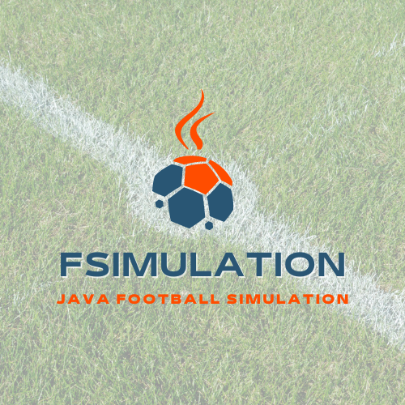
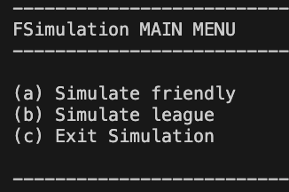
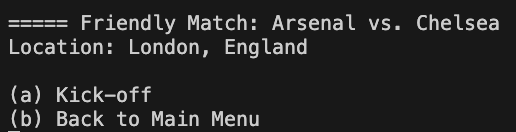
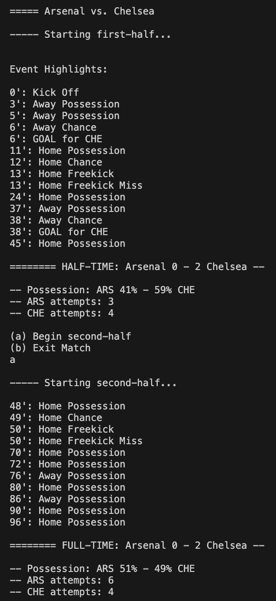
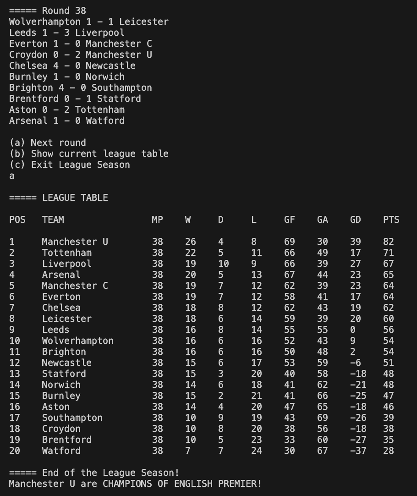

# FSimulation

A Java OOP football simulation project which includes the simulation of leagues and matches between teams based on their FIFA ratings (attack, defence, midfield, and overall rating). The output of the project is shown as the console version.

# Screenshots of features
### Simulate friendly
the game mode where the user can choose two teams to play each other in a simulation friendly. This focuses on details of the match events, statistics and score.

### Simulate league
the game mode where a user can choose a league to simulate a season, including the results per round and display of the final league table.

Possible future plans: Simulate tournament (e.g. Champions League, Europa League, World Cup etc.)

# Match Engine

The match-engine for the simulation was a calculation of ranges based on team ratings:
Factors are based on attack, midfield, defence ratings, overall ratings and home advantage

The re-adjusted ranges are used by the randomiser for deciding:
the team which gets possession,
the team that creates a chance,
the whether the team is able to convert the chance.

Processes of a match (For 90 minutes plus stoppage time):
 
 1. Will some action happen in this minute?
 * -- (Yes, go step 2, No, next minute go step 1)

 2. Home or Away team will gain possession (battle of the midfields)

 3. Will the team, that gains possession, be able to develop it into a chance?
 * -- (OUTCOME: No, go 3a; Yes go 3b)
 * = 3a. Possession lost, next minute, back to step 1,
 * = 3b. Posession develops into a chance

 4. Chance is created from team, will it lead to goal, posession lost or a set-piece?
 * -- (Battle of the attack vs. opponent's defence)
 * -- (OUTCOME: GOAL, go 4a; Possession LOST, go 4b; Set-piece OCCURS, go 4c)
 * = 4a. Chance converted from team, go to step 5,
 * = 4b. Posession is lost from team, back to step 1,
 * = 4c. Chance leads to a set-piece for team (team receives a corner, free-kick or penalty)
 * Which set-piece will the team receive?
 * -- (OUTCOME: corner, go 4ci; free-kick go 4cii; penalty go 4ciii)
 * == 4ci. Team has a corner, will they score from this corner?
 * -- (OUTCOME: Yes, go step 5; No, next minute back to step 1)
 * == 4cii. Team has a free-kick, will they score from this free-kick?
 * -- (OUTCOME: Yes, go step 5; No, next minute back to step 1)
 * == 4ciii. Team has a penalty, will they score from this penalty?
 * -- (OUTCOME: Yes, go step 5; No, next minute back to step 1)
 
 5. Team has SCORED, update scoreboard, go next minute and back to step 1!

 # Game data
 The data with the leagues and teams will be loaded using CSV files.

